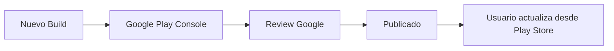
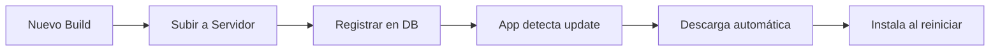

# 📊 Comparación de Sistemas de Build - Android vs Electron

## 🎯 Resumen Rápido

| Característica | Android | Electron |
|----------------|---------|----------|
| **Plataforma** | Móvil (Android) | Desktop (Windows/Mac/Linux) |
| **Output** | APK / AAB | EXE / DMG / AppImage |
| **Tamaño típico** | 20-40 MB | 80-120 MB |
| **Auto-actualización** | Google Play / Direct | Built-in (electron-updater) |
| **Firma requerida** | Sí (para Play Store) | Opcional (recomendado) |
| **Build time** | 2-5 min | 3-8 min |

---

## 🚀 Comandos Comparados

### Build Completo (Producción)

```bash
# Android
node scripts/build-android-apk.cjs

# Electron
node scripts/build-electron-complete.cjs
```

Ambos:
- ✅ Auto-incrementan versión
- ✅ Build completo de la app
- ✅ Generan archivos firmados/instalables
- ✅ Organizan output con nombres descriptivos

### Build Rápido (Desarrollo)

```bash
# Android
node scripts/build-android-quick.cjs
# Output: android/app/build/outputs/apk/debug/

# Electron
node scripts/build-electron-quick.cjs
# Output: release/win-unpacked/
```

Ambos:
- ⚡ Más rápido (sin instalador completo)
- ⚡ Sin incremento de versión
- ⚡ Ideal para testing

### Publicar Actualización

```bash
# Android
# Subir a Google Play Console manualmente

# Electron
node scripts/publish-electron-update.cjs
# Guía interactiva para auto-updater
```

---

## 📋 Flujos de Trabajo Paralelos

### Setup Inicial

| Android | Electron |
|---------|----------|
| `node scripts/setup-android-assets.cjs` | (Assets ya incluidos) |
| `node scripts/setup-android-signing.cjs` | (Opcional, para code signing) |
| `node scripts/build-android-apk.cjs` | `node scripts/build-electron-complete.cjs` |

### Desarrollo Diario

| Android | Electron |
|---------|----------|
| Hacer cambios en código | Hacer cambios en código |
| `node scripts/build-android-quick.cjs` | `node scripts/build-electron-quick.cjs` |
| `adb install -r app.apk` | `./release/win-unpacked/App.exe` |

### Release Completo

| Android | Electron |
|---------|----------|
| `node scripts/build-android-apk.cjs` | `node scripts/build-electron-complete.cjs` |
| Subir APK a Google Play Console | `node scripts/publish-electron-update.cjs` |
| Completar metadata en Play Store | Subir EXE a servidor |
| Publicar release | Registrar en base de datos |
| ✅ Usuarios actualizan desde Play Store | ✅ Usuarios actualizan automáticamente |

---

## 🎯 Diferencias Clave

### 1. Distribución

**Android:**
- Google Play Store (recomendado)
- Direct APK download (alternativa)
- Requiere firma obligatoria para Play Store

**Electron:**
- Auto-updater integrado (built-in)
- Direct download desde tu servidor
- Firma opcional pero recomendada

### 2. Actualización

**Android:**


**Electron:**


### 3. Versionado

**Android:**
- `versionCode` (entero, auto-incrementa)
- `versionName` (string, desde package.json)
- Ambos en `build.gradle`

**Electron:**
- `version` (semver, desde package.json)
- Solo una versión, más simple
- Usado por electron-updater

### 4. Archivos Generados

**Android:**
```
android-release/
├── Sistema-Gestion-Obras-2.3.5-debug-2025-11-30.apk    (debug)
└── Sistema-Gestion-Obras-2.3.5-release-2025-11-30.apk  (release)
```

**Electron:**
```
electron-release/
├── Sistema-Gestion-Obras-2.3.5-win-2025-11-30.exe      (instalador)
├── latest.yml                                           (metadata)
└── update-2.3.5.json                                    (info)
```

---

## 💡 Mejores Prácticas

### Para Android

```bash
# Desarrollo
node scripts/build-android-quick.cjs
adb install -r android/app/build/outputs/apk/debug/app-debug.apk

# Testing en múltiples dispositivos
adb devices
adb -s <device-id> install -r app.apk

# Release
node scripts/build-android-apk.cjs
# Subir Release APK a Google Play
```

### Para Electron

```bash
# Desarrollo
node scripts/build-electron-quick.cjs
./release/win-unpacked/Sistema de Gestion de Obras.exe

# Testing en diferentes máquinas
# Comparte el instalador .exe

# Release + Auto-update
node scripts/build-electron-complete.cjs
node scripts/publish-electron-update.cjs
# Los usuarios reciben actualización automática
```

---

## 🔄 Estrategia de Actualización Unificada

### Opción 1: Versiones Sincronizadas

```bash
# 1. Hacer cambios en código
# ...

# 2. Build ambas plataformas con misma versión
node scripts/version-bump.cjs  # Incrementa a 2.3.6

# 3. Build Android
node scripts/build-android-apk.cjs

# 4. Build Electron
node scripts/build-electron-complete.cjs

# Resultado: Ambas plataformas en v2.3.6
```

### Opción 2: Versiones Independientes

```bash
# Android puede estar en v2.3.6
node scripts/build-android-apk.cjs

# Electron puede estar en v2.4.0
# (editando package.json manualmente antes)
npm version minor
node scripts/build-electron-complete.cjs
```

---

## 📊 Cuando Usar Cada Uno

### Usa Android APK cuando:
- ✅ Necesitas app móvil
- ✅ Usuarios principalmente en teléfonos/tablets
- ✅ Necesitas funciones móviles (GPS, cámara, etc.)
- ✅ Quieres distribución via Play Store

### Usa Electron Desktop cuando:
- ✅ Necesitas app de escritorio
- ✅ Usuarios en PC/laptop
- ✅ Necesitas acceso total al sistema de archivos
- ✅ Quieres auto-actualización inmediata
- ✅ Trabajo intensivo (edición, reportes complejos)

### Usa Ambos cuando:
- ✅ Quieres presencia en todas las plataformas
- ✅ Usuarios usan ambos tipos de dispositivos
- ✅ Necesitas sincronización entre dispositivos
- ✅ Máxima flexibilidad para usuarios

---

## 🎯 Checklist Unificado

### Pre-Build (Ambas Plataformas)

```bash
✅ git commit -am "Changes for v2.3.6"
✅ git tag v2.3.6
✅ Verificar que tests pasen
✅ Verificar que no hay console.errors
```

### Build Android

```bash
✅ node scripts/setup-android-assets.cjs (primera vez)
✅ node scripts/build-android-apk.cjs
✅ Probar APK en dispositivo físico
✅ Verificar permisos funcionan
✅ Subir a Google Play Console
```

### Build Electron

```bash
✅ Verificar resources/icon.png actualizado
✅ node scripts/build-electron-complete.cjs
✅ Probar instalador localmente
✅ Verificar splash screen
✅ node scripts/publish-electron-update.cjs
✅ Subir EXE a servidor
✅ Registrar en base de datos
```

### Post-Release (Ambas)

```bash
✅ git push && git push --tags
✅ Monitorear logs de errores
✅ Verificar que usuarios reciben updates
✅ Documentar cambios en changelog
```

---

## 📚 Documentación Relacionada

### Android
- [BUILD-ANDROID-GUIDE.md](./BUILD-ANDROID-GUIDE.md) - Guía completa
- [ANDROID-BUILD-COMMANDS.md](./ANDROID-BUILD-COMMANDS.md) - Referencia rápida
- [QUICK-START-ANDROID.md](./QUICK-START-ANDROID.md) - Inicio rápido
- [README-APK.md](./README-APK.md) - Configuración detallada

### Electron
- [BUILD-ELECTRON-GUIDE.md](./BUILD-ELECTRON-GUIDE.md) - Guía completa
- [ELECTRON-BUILD-COMMANDS.md](./ELECTRON-BUILD-COMMANDS.md) - Referencia rápida
- [README-ELECTRON.md](./README-ELECTRON.md) - Configuración básica

---

## 💻 Scripts de Automatización Total

### Build Todo

Crea `scripts/build-all.sh`:

```bash
#!/bin/bash
echo "🚀 Building todas las plataformas..."

# Android
echo "📱 Building Android..."
node scripts/build-android-apk.cjs
if [ $? -ne 0 ]; then
    echo "❌ Android build failed"
    exit 1
fi

# Electron
echo "💻 Building Electron..."
node scripts/build-electron-complete.cjs
if [ $? -ne 0 ]; then
    echo "❌ Electron build failed"
    exit 1
fi

echo "✅ Todas las plataformas construidas exitosamente!"
echo ""
echo "📱 Android APKs: android-release/"
echo "💻 Electron EXE: electron-release/"
```

Usar:
```bash
chmod +x scripts/build-all.sh
./scripts/build-all.sh
```

---

**✨ Con estos sistemas, tienes builds automatizados y profesionales para ambas plataformas!**
