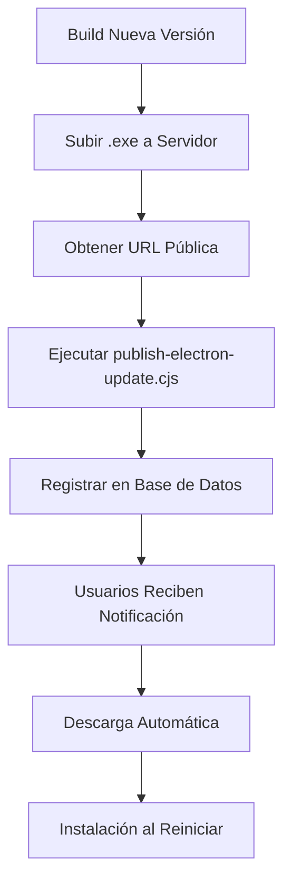

# 💻 Guía Completa de Build Automático - Electron Desktop

## 📋 Scripts Disponibles

### 1️⃣ Build Completo con Versión (Recomendado para Releases)
```bash
node scripts/build-electron-complete.cjs
```

**Qué hace:**
- ✅ Incrementa automáticamente la versión
- ✅ Construye la aplicación web
- ✅ Valida y convierte iconos
- ✅ Genera instalador Windows (.exe)
- ✅ Genera archivos para auto-updater (latest.yml)
- ✅ Organiza archivos en `electron-release/` con nombres descriptivos

**Resultado:**
```
electron-release/
├── Sistema-Gestion-Obras-2.3.5-win-2025-11-30.exe
├── latest.yml (metadata auto-updater)
└── update-2.3.5.json (info de publicación)
```

### 2️⃣ Build Rápido (Para Pruebas)
```bash
node scripts/build-electron-quick.cjs
```

**Qué hace:**
- ✅ Construye aplicación web
- ✅ Genera ejecutable sin instalador (más rápido)
- ✅ Salida en `release/win-unpacked/`
- ❌ NO incrementa versión
- ❌ NO crea instalador

**Uso:** Pruebas rápidas durante desarrollo.

### 3️⃣ Publicar Actualización (Auto-Updater)
```bash
node scripts/publish-electron-update.cjs
```

**Qué hace:**
- 📤 Guía interactiva para publicar updates
- 📤 Genera metadata para auto-updater
- 📤 Crea SQL para registrar en base de datos
- 📤 Instrucciones paso a paso

## 🚀 Flujo de Trabajo Completo

### Primera Vez (Setup)

```bash
# 1. Clonar proyecto
git pull
npm install

# 2. Primer build
node scripts/build-electron-complete.cjs
```

### Desarrollo Diario

**Para pruebas rápidas:**
```bash
node scripts/build-electron-quick.cjs
# Ejecutar: release/win-unpacked/Sistema de Gestion de Obras.exe
```

**Para release/versión:**
```bash
node scripts/build-electron-complete.cjs
```

### Publicar Actualización

```bash
# 1. Build con nueva versión
node scripts/build-electron-complete.cjs

# 2. Publicar update
node scripts/publish-electron-update.cjs

# 3. Seguir instrucciones en pantalla
```

## 🔄 Sistema de Auto-Actualización

### Cómo Funciona

1. **Usuario abre la app** → Verifica actualizaciones en background
2. **Nueva versión disponible** → Muestra notificación
3. **Usuario acepta** → Descarga e instala automáticamente
4. **Reinicia la app** → Versión actualizada

### Componentes del Sistema

```
electron/
└── main.js                    # Auto-updater integrado (electron-updater)

src/
├── components/
│   ├── UpdateManager.tsx      # Gestión de actualizaciones en la app
│   └── UpdateNotification.tsx # Notificación de update disponible
└── hooks/
    └── useAppUpdates.ts       # Hook para verificar updates

supabase/
└── functions/
    └── check-updates/         # Endpoint para verificar versiones
```

### Configuración Auto-Updater

**En `electron-builder.config.js`:**
```js
publish: {
  provider: 'generic',
  url: 'https://tu-servidor.com/downloads/'
}
```

**En `electron/main.js`:**
- Ya está configurado con `electron-updater`
- Verifica updates al iniciar la app
- Descarga e instala automáticamente
- Reinicia cuando el usuario cierra la app

### Flujo de Publicación de Updates



## 📦 Gestión de Versiones

### Versión Automática
El script `build-electron-complete.cjs` incrementa automáticamente:
- `package.json` → version (2.3.4 → 2.3.5)
- `.env` → VITE_APP_VERSION (sincronizado)

### Versión Manual
```bash
npm version patch  # 2.3.4 → 2.3.5
npm version minor  # 2.3.4 → 2.4.0
npm version major  # 2.3.4 → 3.0.0

# Luego build
node scripts/build-electron-complete.cjs
```

### Versionado Semántico

- **MAJOR** (x.0.0): Cambios incompatibles
- **MINOR** (0.x.0): Nuevas funcionalidades compatibles
- **PATCH** (0.0.x): Corrección de bugs

## 🎨 Iconos y Branding

### Configuración de Iconos

```
resources/
├── icon.png          # Icono principal (512x512)
├── icon.ico          # Generado automáticamente para Windows
└── splash.png        # Splash screen
```

### Scripts de Iconos

```bash
# Validar icono
node scripts/validate-icon.cjs

# Convertir PNG a ICO
node scripts/convert-icon-to-ico.cjs
```

**Los scripts de build ejecutan esto automáticamente.**

## 🔧 Configuración Avanzada

### Multi-Plataforma

```bash
# Windows
node scripts/build-electron-complete.cjs

# macOS (necesita macOS)
npx electron-builder --mac

# Linux
npx electron-builder --linux
```

### Personalizar electron-builder.config.js

```js
module.exports = {
  appId: 'com.partesdetrabajo.app',
  productName: 'Sistema de Gestion de Obras',
  
  // Configurar auto-updater
  publish: {
    provider: 'generic',
    url: 'https://your-domain.com/downloads/'
  },
  
  // Configuración Windows
  win: {
    target: ['nsis'],
    icon: 'resources/icon.ico'
  },
  
  // Configuración NSIS installer
  nsis: {
    oneClick: false,
    allowToChangeInstallationDirectory: true,
    createDesktopShortcut: true,
    guid: 'f8c5e4d3-2a1b-4c9d-8e7f-6a5b4c3d2e1f' // Importante para updates
  }
};
```

## 📤 Publicación de Actualizaciones

### Opción A: Desde la App (Recomendado)

1. **Inicia sesión como administrador**
2. **Ve a "Actualizaciones" en la app**
3. **Haz clic en "Publicar Nueva Actualización"**
4. **Completa el formulario:**
   - Versión: 2.3.5
   - Plataforma: Windows
   - URL del archivo: https://tu-servidor.com/downloads/Sistema-Gestion-Obras-2.3.5.exe
   - Notas: Descripción de cambios
   - ¿Obligatoria?: Sí/No

### Opción B: SQL Directo

```sql
INSERT INTO app_versions (
  version, 
  platform, 
  file_url, 
  file_size,
  release_notes, 
  is_mandatory
)
VALUES (
  '2.3.5',
  'windows',
  'https://tu-servidor.com/downloads/Sistema-Gestion-Obras-2.3.5.exe',
  85000000,
  'Nuevas funcionalidades y correcciones',
  false
);
```

### Opción C: Usando el Script

```bash
node scripts/publish-electron-update.cjs
# Sigue las instrucciones interactivas
```

## 🌐 Hosting de Archivos

### Opciones de Hosting

1. **Tu propio servidor**
   ```bash
   # Subir vía FTP/SFTP
   scp electron-release/Sistema-*.exe user@server:/var/www/downloads/
   ```

2. **GitHub Releases**
   - Crear release en GitHub
   - Subir el .exe como asset
   - Copiar URL del asset

3. **AWS S3**
   ```bash
   aws s3 cp Sistema-Gestion-Obras-2.3.5.exe s3://mybucket/downloads/
   aws s3 presign s3://mybucket/downloads/Sistema-Gestion-Obras-2.3.5.exe
   ```

4. **Cloudflare R2 / DigitalOcean Spaces**
   - Similar a S3
   - Más económico para archivos grandes

### Consideraciones

- ✅ URL debe ser pública y accesible
- ✅ HTTPS recomendado (pero no obligatorio)
- ✅ Sin límite de descarga (o suficientemente alto)
- ⚠️ Los usuarios descargarán 60-100 MB por update

## 🎯 Casos de Uso Comunes

### Caso 1: "Necesito probar cambios rápidamente"
```bash
node scripts/build-electron-quick.cjs
release/win-unpacked/Sistema de Gestion de Obras.exe
```

### Caso 2: "Voy a lanzar una nueva versión"
```bash
node scripts/build-electron-complete.cjs
node scripts/publish-electron-update.cjs
# Subir archivo y registrar en base de datos
```

### Caso 3: "Actualización urgente de seguridad"
```bash
node scripts/build-electron-complete.cjs
node scripts/publish-electron-update.cjs
# Marcar como obligatoria cuando el script lo pregunte
```

### Caso 4: "Solo quiero actualizar el icono"
```bash
# Reemplaza resources/icon.png con tu nuevo icono
node scripts/build-electron-complete.cjs
```

## 🔧 Troubleshooting

### Error: "electron-builder not found"
```bash
npm install
# Asegúrate que electron y electron-builder estén instalados
```

### Error: "Icon file invalid"
```bash
# Verifica que resources/icon.png sea PNG válido
# Tamaño mínimo: 256x256
# Recomendado: 512x512 o 1024x1024
```

### Error: "Build failed" en Windows
```bash
# Necesitas Visual Studio Build Tools
# Descarga: https://visualstudio.microsoft.com/downloads/
# O instala: npm install --global windows-build-tools
```

### Auto-updater no funciona
```bash
# 1. Verifica que latest.yml esté en el servidor
# 2. Verifica URL en electron-builder.config.js
# 3. Verifica que la versión en DB sea mayor
# 4. Verifica logs en electron console
```

### Instalador muy grande (>150MB)
```bash
# Normal para app Electron con React
# El instalador incluye:
# - Runtime de Chromium (~80MB)
# - Node.js runtime (~30MB)
# - Tu aplicación (~20-40MB)
```

### "Latest version already installed"
```bash
# Incrementa la versión manualmente
npm version patch
node scripts/build-electron-complete.cjs
```

## 📊 Estructura de Directorios

```
proyecto/
├── electron/                    # Código Electron
│   ├── main.js                 # Main process (con auto-updater)
│   └── preload.js              # Preload script
├── electron-release/            # Builds organizados (auto-creado)
│   ├── Sistema-Gestion-Obras-2.3.5-win-2025-11-30.exe
│   ├── latest.yml
│   └── update-2.3.5.json
├── release/                     # Output de electron-builder
│   ├── win-unpacked/           # Ejecutable sin instalar (quick build)
│   └── Sistema-*.exe           # Instalador
├── resources/                   # Assets
│   ├── icon.png
│   ├── icon.ico (generado)
│   └── splash.png
├── scripts/
│   ├── build-electron-complete.cjs
│   ├── build-electron-quick.cjs
│   └── publish-electron-update.cjs
└── electron-builder.config.js  # Configuración builder
```

## 💡 Tips Pro

1. **Backup antes de build importante:**
   ```bash
   git commit -am "Pre-release backup"
   git tag v2.3.5
   node scripts/build-electron-complete.cjs
   ```

2. **Testing local de auto-updater:**
   ```bash
   # En electron/main.js, cambiar temporalmente:
   autoUpdater.setFeedURL({
     provider: 'generic',
     url: 'http://localhost:3000/downloads/'
   });
   # Servir archivos localmente con http-server
   ```

3. **Builds paralelos (si tienes recursos):**
   ```bash
   # Terminal 1
   node scripts/build-electron-complete.cjs
   
   # Terminal 2 (cuando termine el anterior)
   node scripts/build-android-apk.cjs
   ```

4. **Automatizar todo:**
   ```bash
   # Crear script personal
   #!/bin/bash
   node scripts/build-electron-complete.cjs && \
   node scripts/publish-electron-update.cjs && \
   echo "✅ Build y publicación completos"
   ```

## 🔐 Firma de Código (Code Signing)

### ¿Por qué firmar?

- ✅ Windows no mostrará "Publisher Unknown"
- ✅ SmartScreen no bloqueará tu app
- ✅ Los usuarios confiarán más en tu app

### Cómo Firmar (Windows)

```bash
# 1. Obtener certificado de code signing
# Proveedores: DigiCert, Sectigo, etc.

# 2. Configurar en electron-builder.config.js
win: {
  certificateFile: './certs/certificate.pfx',
  certificatePassword: process.env.CERT_PASSWORD,
  sign: './scripts/sign.js' // Custom signing script
}

# 3. Build con firma
node scripts/build-electron-complete.cjs
```

## 📚 Referencias

- [Electron Documentation](https://www.electronjs.org/docs)
- [electron-builder Documentation](https://www.electron.build/)
- [electron-updater Documentation](https://www.electron.build/auto-update)
- [README-ELECTRON.md](./README-ELECTRON.md) - Guía básica
- [Componente UpdatesManager](./src/components/UpdatesManager.tsx)

## 🎬 Resumen Rápido

```bash
# Desarrollo
node scripts/build-electron-quick.cjs

# Release
node scripts/build-electron-complete.cjs
node scripts/publish-electron-update.cjs

# ¡Listo! Los usuarios recibirán la actualización automáticamente.
```
